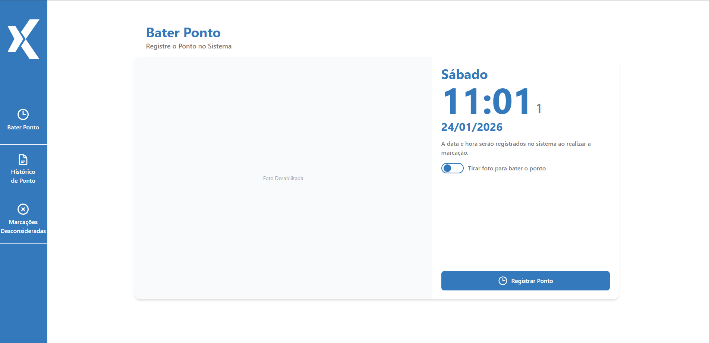
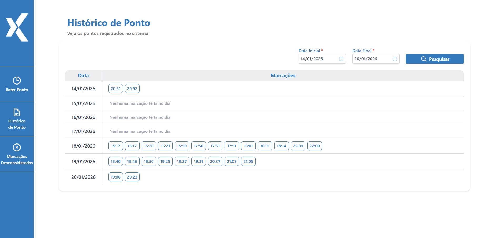
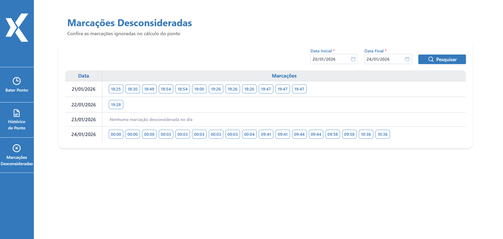
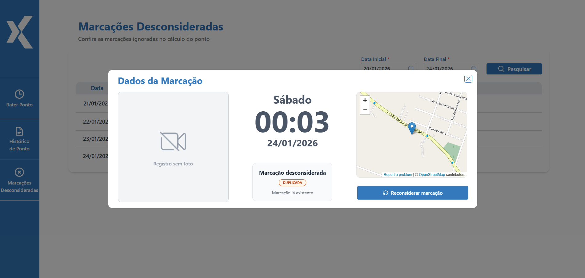

## 📌 Sobre o projeto

Este projeto é uma **aplicação web de marcação de ponto**, desenvolvida como parte do desafio técnico **Prova DEV 2026**.

A aplicação é composta por **frontend e backend**, onde o frontend é responsável pela interface e interação com o usuário, e o backend pela aplicação das **regras de negócio**, validações e persistência dos dados.

O sistema permite o registro de marcações de ponto **com ou sem foto**, aplicando a regra de **intervalo mínimo de 1 minuto entre registros**. Quando essa regra não é atendida, a marcação é automaticamente desconsiderada, com o motivo devidamente registrado.

Após cada tentativa de marcação, o sistema retorna um **resumo do registro**, informando data, hora e status da marcação (registrada ou desconsiderada). Também é possível consultar o **histórico de marcações**, incluindo registros válidos e desconsiderados, com acesso aos seus detalhes e motivos.

Quando disponível, a aplicação captura a **localização geográfica (latitude e longitude)** no momento da marcação, permitindo a visualização do local registrado em um mapa, tanto no registro quanto no histórico.

## 🖥️ Telas da aplicação

### Bater Ponto



Tela principal para registro de ponto. O usuário pode realizar a marcação com ou sem foto.
A data e hora exibidas são registradas no sistema no momento da marcação, respeitando o
intervalo mínimo de 1 minuto entre os registros.

### Histórico de Ponto



Exibe o histórico de marcações agrupadas por data, com possibilidade de filtro por período.
Cada marcação pode ser selecionada para visualização de seus detalhes.

### Dados da Marcação


Exibe os detalhes de uma marcação selecionada, incluindo data, hora, foto (quando existente)
e a localização geográfica no mapa. Também permite desconsiderar a marcação quando aplicável.

### Marcações Desconsideradas



Lista as marcações desconsideradas no cálculo do ponto, permitindo a consulta por período
e a visualização dos registros ignorados pelo sistema.

### Dados da Marcação Desconsiderada



Exibe os detalhes de uma marcação desconsiderada, informando o motivo da desconsideração
e permitindo a reconsideração da marcação, quando disponível.

## ✅ Testes realizados

Durante o desenvolvimento, foram realizados **testes manuais** contemplando cenários comuns e casos de borda.

### Regras de desconsideração e reconsideração

- Desconsideração automática de marcações duplicadas;
- Reconsideração de marcação desconsiderada, validando a existência de outra marcação válida no mesmo minuto (reconsideração bloqueada quando aplicável);
- Teste de desconsideração da marcação original e tentativa de reconsideração da marcação duplicada.

### Registro de ponto

- Registro de ponto exatamente às **00:00**;
- Tentativa de múltiplas marcações em sequência (intervalo inferior a 1 minuto);
- Registro de marcação na **virada do dia (23:59 → 00:00)**;
- Realização de marcações em **anos diferentes**;
- Registro de marcação com e sem foto.

### Permissões e falhas esperadas

- Tentativa de marcação sem permissão de câmera;
- Tentativa de marcação sem permissão de localização;
- Validação do comportamento do sistema quando permissões são negadas.

### Localização

- Registro de marcações em **localizações diferentes**;
- Testes com valores extremos de coordenadas geográficas:
  - Latitude: `-90` e `90`
  - Longitude: `-180` e `180`

## 🛠️ Tecnologias utilizadas

### Backend

- **Java**
- **Spring Boot** — construção da API e aplicação das regras de negócio
- **Maven** — gerenciamento de dependências e build
- **MySQL** — persistência dos dados
- **Docker / Docker Compose** — configuração e execução dos serviços de infraestrutura

### Frontend

- **JavaScript**
- **React** — construção da interface do usuário
- **Vite** — ambiente de desenvolvimento e build
- **Tailwind CSS** — estilização da interface
- **HTML5 e CSS3**

### Outros

- **OpenStreetMap** — visualização de localização geográfica no mapa
- **Git** — versionamento de código

## 📂 Estrutura do projeto

```text
DIXI-PROVA-DEV-2026
├── backend/
│   └── dixiBackend/
│       ├── src/                # Código-fonte da aplicação backend
│       ├── .mvn/               # Configurações do Maven Wrapper
│       ├── target/             # Arquivos gerados no build
│       ├── docker-compose.yml  # Orquestração dos serviços (ex.: banco de dados)
│       ├── pom.xml             # Gerenciamento de dependências e build
│       ├── mvnw / mvnw.cmd     # Maven Wrapper
│       └── HELP.md             # Instruções auxiliares do backend
│
├── frontend/
│   ├── docs/                   # Imagens e assets usados no README
│   ├── public/                 # Arquivos públicos do frontend
│   ├── src/                    # Código-fonte da aplicação frontend
│   ├── index.html              # Entry point da aplicação
│   ├── package.json            # Dependências e scripts do frontend
│   ├── vite.config.js          # Configuração do Vite
│   ├── tailwind.config.js      # Configuração do Tailwind CSS
│   └── postcss.config.js       # Configuração do PostCSS
│
├── README.md                   # Documentação do projeto
└── .gitignore                  # Arquivos ignorados pelo Git
```
